<div align="center">



</div>

<br/>

<div align="center">

**`building AI that outsmarts other AI`** &nbsp;·&nbsp; **`B.Tech Math + Computing @ IIITM Gwalior`** &nbsp;·&nbsp; **`ex-Britannia`**

</div>

---

## ▚ &nbsp;What I'm actually doing

I build systems where **AI agents compete, cooperate, and occasionally betray each other** — then I build the tooling to measure exactly how well they do it. Somewhere between game theory, operations research, and "what if the OS scheduler, but for LLMs."

```
current_focus  →  multi-agent orchestration + benchmarking under adversarial conditions
comfort_zone   →  optimization, time-series, anything with a loss function to minimize
side_effect    →  a LeetCode Knight badge I refuse to let decay
```

---

## ▚ &nbsp;Things I built that I'm proud of

<table>
<tr>
<td width="33%" valign="top">

### 🃏 Agent Poker
LLMs bluff, form alliances, and stab each other at a poker table. An **adversity-adjusted scoring engine** quantifies their deception and strategic manipulation. Machine scheming — as a benchmark.

`FastAPI` · `PostgreSQL` · `Redis` · `SSE`

**→ [repo](https://github.com/hemeshch/bluffhouse)**

</td>
<td width="33%" valign="top">

### 🧬 AgentOS
An **OS-inspired runtime** for LLM agents: cost-aware scheduling, token-budget allocation, and multi-criteria model routing (cost / latency / context), all on a live D3.js dashboard streamed over WebSockets.

`PyTorch` · `React` · `D3.js` · `WS`

**→ [repo](https://github.com/Varshith-06/AgentOS)**

</td>
<td width="33%" valign="top">

### 😈 Adversarial 2048
2048 that **fights back**. A CNN studies your moves and drops tiles designed to end your run. Average player survival: **−40%**. Full-stack, real-time worst-case inference.

`TensorFlow` · `Django` · `React`

**→ [repo](https://github.com/Varshith-06/2048onSteroids)**

</td>
</tr>
</table>

---

## ▚ &nbsp;The stack

<div align="center">



</div>

<div align="center">


</div>

---

## ▚ &nbsp;Field notes

> **@ Britannia Industries** — forecasted wholesale stock with LightGBM / LSTMs / Temporal Fusion Transformers to **~4% MAPE**, wrote a TSP-variant routing algorithm that cut **3+ hours off daily salesman travel time**, and shipped a Streamlit + RAG dashboard to a **200-person team**.

> **JEE Mains 2024** — 98.84 percentile out of 1.6M+ · &nbsp; **LeetCode** — Knight, 1850+ contest rating · &nbsp; **CGPA** — 9.18/10

---

## ▚ &nbsp;GitHub telemetry

<div align="center">


<br/>


</div>

<br/>

<!-- the snake eats your contributions -->
<div align="center">

<picture>
  <source media="(prefers-color-scheme: dark)" srcset="https://raw.githubusercontent.com/Varshith-06/Varshith-06/output/github-contribution-grid-snake-dark.svg" />
  
</picture>

</div>

---

<div align="center">

### ▚ &nbsp;Open a channel

<a href="https://linkedin.com/in/sai-varshith-paluru"></a>
<a href="mailto:saivarshith2006@gmail.com"></a>
<a href="https://leetcode.com/u/Flare6/"></a>

<br/><br/>

<sub><code>if you scrolled this far, the least you can do is star a repo</code></sub>

</div>
